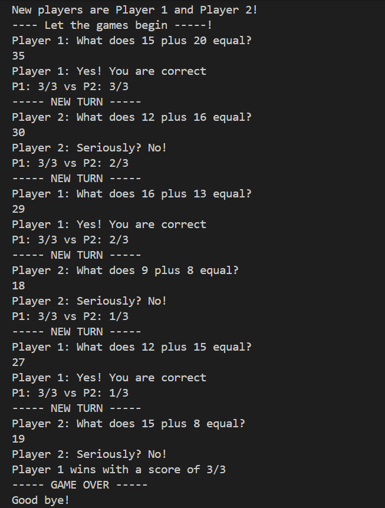
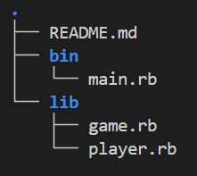

# Two-player Math Game
This is a 2-Player math game where players take turns to answer simple math addition problems. This game is created in Ruby.

## Game Rules 🏆
- Both players start with 3 lives. 
- A new math question is generated for each turn by picking two numbers between 1 and 20. 
- The player whose turn it is is prompted the question and must answer correctly or lose a life.
- The game doesn’t end until one of the players loses all their lives.
- At this point, the game will announce the winner and the winner's score.

## Getting Started ✨
1. Clone this directory.

2. Run ```ruby bin/main.rb``` in the command line interface from the project root directory.

3. Type your answer when prompted, and hit enter to submit.

Have Fun!




## Project Structure

